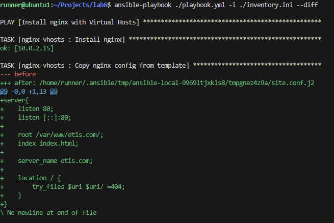
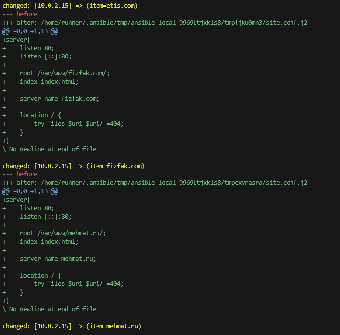
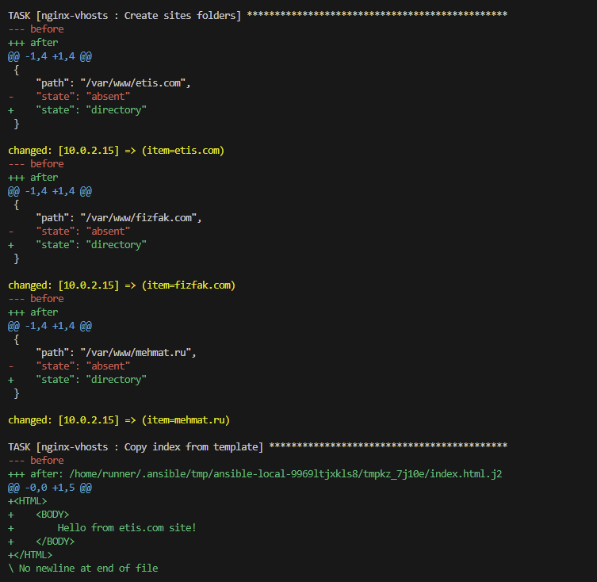
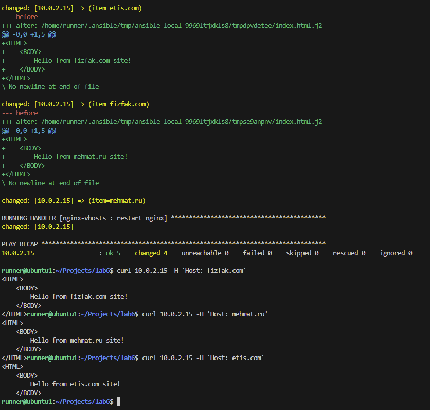
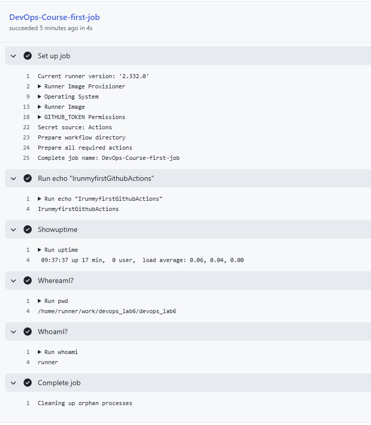

# Понимание

Роли  - это как отдельные структурные блоки, отличие от тасок в том, что таски - элементарный блок, а роли составной (объединение по задаче, то есть роль выполняет какую либо задачу)

# Результаты

По результатам видно, что сайты развернуты (проверено при помощи curl)

# CI лаба

По сути мы сделали первым ямл файлом обычную проверку вм на стороне гитхаба, вывели командами основные значения из ее окружения

